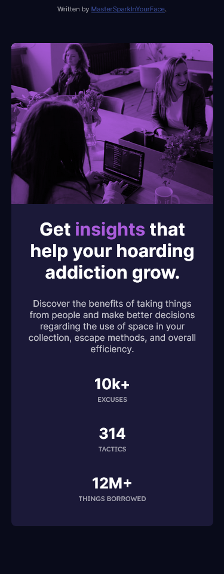

# Frontend Mentor - Stats preview card component solution

This is a solution to the [Stats preview card component challenge on Frontend Mentor](https://www.frontendmentor.io/challenges/stats-preview-card-component-8JqbgoU62). 

## Overview

### Screenshots (desktop and mobile viewports)

### Built with

- HTML5
- Sass (SCSS)
- flexbox

### Resources

- [MDN](https://developer.mozilla.org): first reference for web things
- [Sass docs](https://sass-lang.com/documentation): SCSS reference
- [StackOverflow](https://stackoverflow.com): obviously